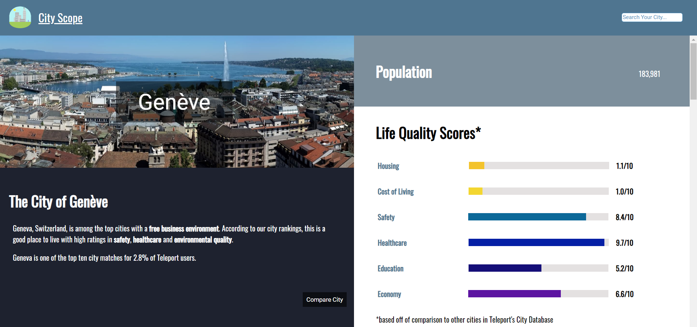
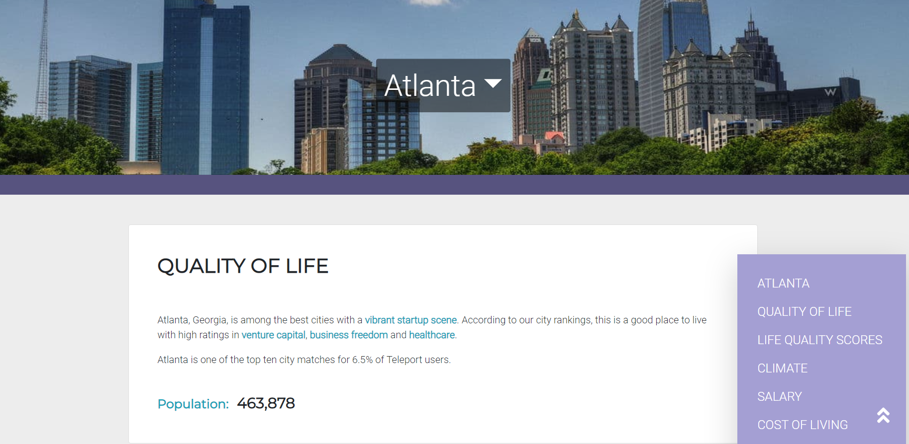

# City Scope (solo)

## Overview 
This is a completely independently coded version of the group project that I led called "City Scope". This React app serves the function of pulling information from Teleport City's [open source API](https://developers.teleport.org/api/) with the aim of providing enough information for users to make a decision regarding which major city to move to out of the 266 cities it contains information on.

## Changes

Changes To This App Include
- Complete rewrite of the code with React Hooks and Context API
- a complete visual redesign throughout the entire app as well as all SVGs within the app created by myself via Figma
- refined redirection to cities close to user's search with a dismissable modal explaining the Teleport City's API decision to display this geographically close alternative

Current Design

Previous Design

SVGs created for use in site

- clickable lists of all of the cities that Teleport has information on with some organized by continents
- a new failed search page that provides the clickable list for an easier transition to a valid city page
- a comparison page that allows two cities' information to be compared side by side by the user that is 
  responsive to viewport sizes - making it only available on desktop and tablet devices

## Retained Features

Information about 266 cities including:
- General Description/City Highlights
- Rating In Select Categories Compards to Other Cities in the Teleport API database
- Average High and Low Temperature in Celsius and Fahrenheit as well as Climate Type
- Average Cost of Apartments
- Daily Living Expenses Examples
- Average Salary for Select Professions
- Educational Quality Data in the form of PISA scores of the city
- Safety Information via Gun Statistics - both global and per city selected

### Dev Dependencies
- Axios
- React-HTML-Parser
- React-Router-Dom
- Semantic-UI-React
- Victory
